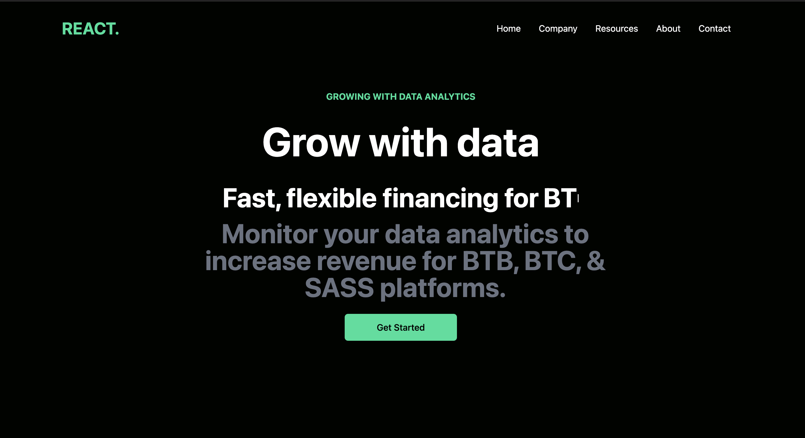

# Data-Finance


# Description

We will install and use Tailwind CSS in a “Create-React-App” application. Use a really cool react package “Typed-js” for some text animation in the Hero component. UseState hook to toggle the mobile side drawer menu. Import “React-Icons” dependency for social icons.  Incorporate both flexbox and grid layouts. 


## Table of Contents (Optional)
- [Installation](#installation)
- [Usage](#usage)
- [Credits](#credits)
- [License](#license)

## Installation

To install necessary dependencies, please run the following command: 

```bash
npm install 
```


[link to deployed application](sidiq96.github.io/data-finance/)

## Usage
This application allows users to buy products at an online store.

# Credits
*[W3 School](https://www.w3schools.com/js/default.asp)
*[code academy](https://www.codecademy.com/learn)
*[mozilla developer](https://developer.mozilla.org/en-US/docs/Web/) 
*[React Icons](https://react-icons.github.io/react-icons/) 
*[React Router](https://reactrouter.com/en/main) 
*[Font Awesome](https://fontawesome.com/start)
*[NPM](https://www.npmjs.com/)
*[Tailwind CSS](https://tailwindcss.com/)


## License
This project is licensed under the MIT license.
